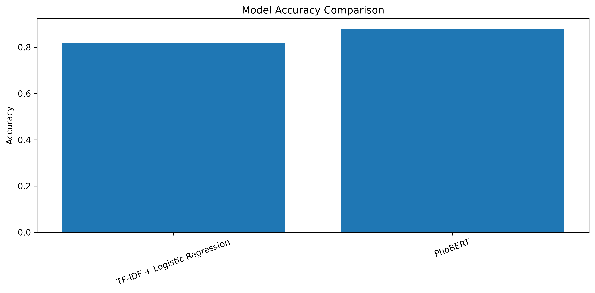
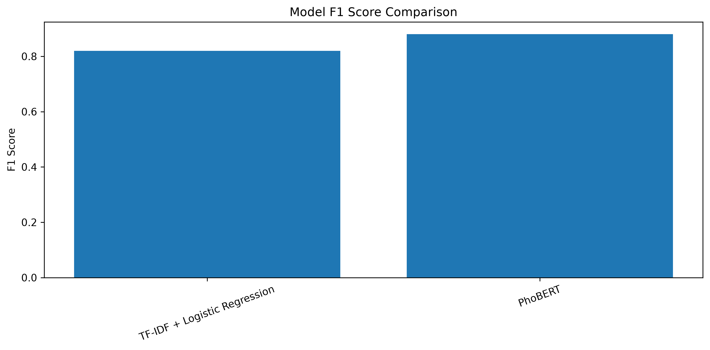
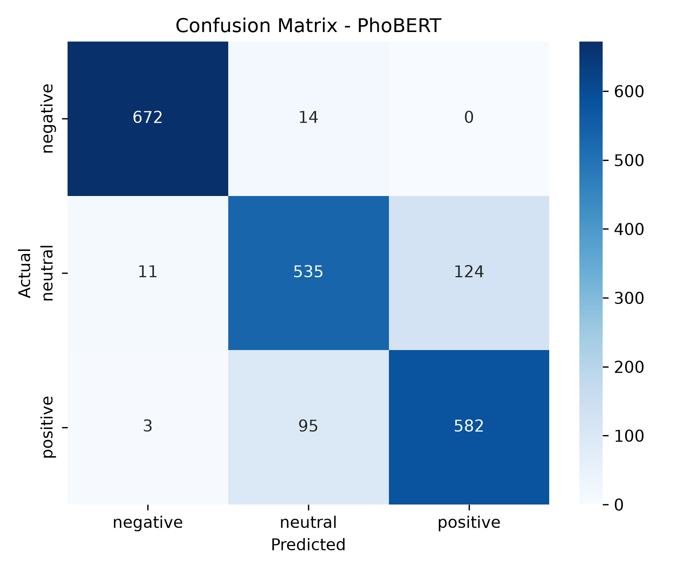
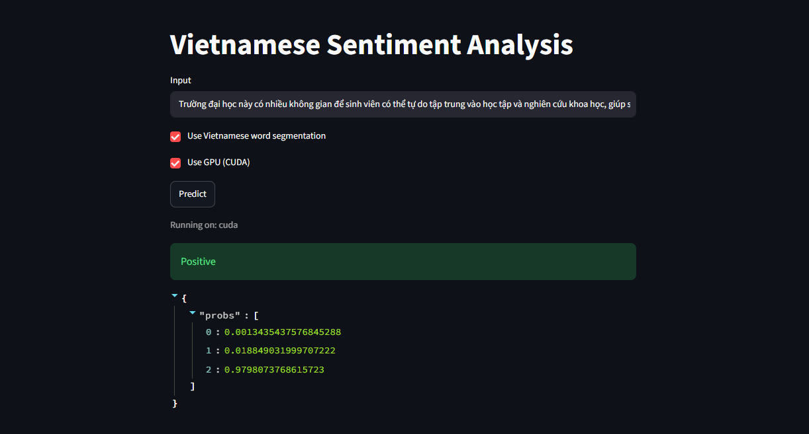

# Vietnamese Sentiment Analysis using PhoBERT

## Project Overview

This project aims to classify Vietnamese student feedback into three sentiment categories: **Negative**, **Neutral**, and **Positive** using deep learning techniques.

The project follows a complete Natural Language Processing (NLP) workflow, including:

- Exploratory Data Analysis (EDA)
- Data preprocessing
- Baseline model using TF-IDF and Logistic Regression
- Fine-tuning PhoBERT
- Model evaluation
- Model comparison
- Interactive sentiment prediction with Streamlit

The project is implemented using PyTorch and Hugging Face Transformers on the UIT-VSFC dataset.

---

## Key Results

| Metric | Value |
|---------|------:|
| Best Model | PhoBERT + PyVi |
| Accuracy | **88.02%** |
| F1 Score | **88.00%** |
| Classes | Negative, Neutral, Positive |

Compared with the traditional TF-IDF + Logistic Regression baseline, the proposed PhoBERT model achieved a significant improvement in classification performance.

---

## Dataset

Dataset: **UIT-VSFC (Vietnamese Students Feedback Corpus)**

The dataset consists of three columns:

| Column | Description |
|---------|-------------|
| sentence | Vietnamese student feedback |
| sentiment | Sentiment label |
| topic | Feedback topic |

### Sentiment Labels

| Label |
|-------|
| negative |
| neutral |
| positive |

### Dataset Split

| Split | Samples |
|-------|---------:|
| Train | 8,144 |
| Validation | 2,036 |

---

## Project Workflow

The project consists of the following stages:

1. Exploratory Data Analysis
2. Data Preprocessing
3. Baseline Model (TF-IDF + Logistic Regression)
4. PhoBERT Fine-tuning
5. Hyperparameter Optimization
6. Model Evaluation
7. Model Comparison
8. Streamlit Application

---

## Exploratory Data Analysis

The following analyses were performed:

- Missing value analysis
- Duplicate sample analysis
- Sentiment distribution
- Topic distribution
- Sentence length analysis

### Sentiment Distribution

<p align="center">
    
</p>

### Topic Distribution

<p align="center">
    
</p>

### Sentence Length Distribution

<p align="center">
    
</p>

---

## Models

### Baseline Model

The baseline model uses:

- TF-IDF Vectorizer
- Logistic Regression

This model provides a traditional machine learning benchmark for comparison.

### Proposed Model

The final model consists of:

- PhoBERT-base
- PyVi word segmentation
- Maximum sequence length: 48
- Hugging Face Trainer
- PyTorch

---

## Model Performance

| Model | Accuracy | F1 Score |
|--------|---------:|---------:|
| TF-IDF + Logistic Regression | 82.00% | 82.00% |
| PhoBERT + PyVi | **88.02%** | **88.00%** |

### Accuracy Comparison

<p align="center">
    
</p>

### F1 Score Comparison

<p align="center">
    
</p>

### Confusion Matrix

<p align="center">
    
</p>

---

## Streamlit Application

An interactive web application was developed using Streamlit.

The application allows users to:

- Input Vietnamese text
- Predict sentiment
- Display prediction confidence

Example interface:

<p align="center">
    
</p>

---

## Project Structure

```text
Vietnamese-Sentiment-Analysis
│
├── dataset/
│   ├── train.csv
│   └── val.csv
│
├── notebooks/
│   ├── EDA.ipynb
│   ├── Baseline.ipynb
│   ├── PhoBERT.ipynb
│   └── Compare_Models.ipynb
│
├── src/
│
├── models/
│
├── images/
│
├── app.py
├── requirements.txt
├── .gitignore
└── README.md
```

---

## Technologies

The project uses the following libraries and frameworks:

- Python
- PyTorch
- Hugging Face Transformers
- PhoBERT
- PyVi
- Scikit-learn
- Pandas
- NumPy
- Matplotlib
- Streamlit

---

## Installation

Clone the repository:

```bash
git clone https://github.com/Sinister-VN/Vietnamese-Sentiment-Analysis.git

cd Vietnamese-Sentiment-Analysis
```

Create a virtual environment:

```bash
python -m venv venv
```

Activate the virtual environment.

Windows:

```bash
venv\Scripts\activate
```

Linux / macOS:

```bash
source venv/bin/activate
```

Install dependencies:

```bash
pip install -r requirements.txt
```

> **Note:** The requirements file was generated from the final tested environment to ensure reproducibility.

---

## Usage

Launch the Streamlit application:

```bash
streamlit run app.py --server.fileWatcherType none
```

---

## Repository Contents

| Notebook | Description |
|----------|-------------|
| EDA.ipynb | Exploratory data analysis |
| Baseline.ipynb | TF-IDF + Logistic Regression |
| PhoBERT.ipynb | PhoBERT fine-tuning |
| Compare_Models.ipynb | Performance comparison |

---

## Future Improvements

Possible future work includes:

- Deploy the Streamlit application
- Experiment with larger Vietnamese language models
- Hyperparameter optimization
- Topic-aware sentiment classification
- Error analysis on misclassified samples

---

## Author

Nguyen Nam

GitHub:

https://github.com/Sinister-VN