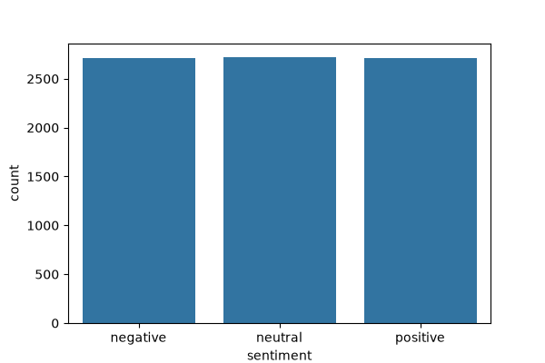
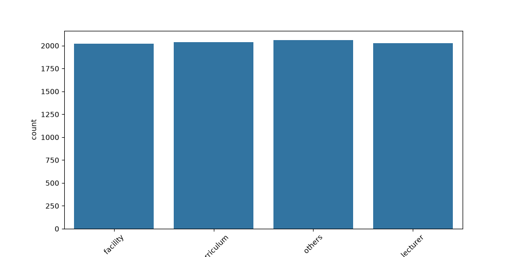
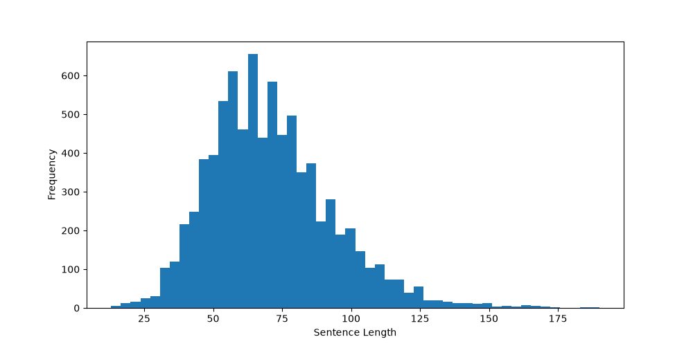

# Vietnamese Sentiment Analysis using PhoBERT

## Overview

This project focuses on Vietnamese Sentiment Analysis using the UIT-VSFC (Vietnamese Students Feedback Corpus) dataset. The goal is to classify student feedback into three sentiment categories:

* Negative
* Neutral
* Positive

The project follows a complete NLP pipeline:

1. Exploratory Data Analysis (EDA)
2. Data Preprocessing
3. Baseline Model (TF-IDF + Logistic Regression)
4. Fine-tuning PhoBERT
5. Model Evaluation
6. Streamlit Web Demo

---

## Dataset

Dataset: **UIT-VSFC (Vietnamese Students Feedback Corpus)**

The dataset contains three columns:

| Column    | Description               |
| --------- | ------------------------- |
| sentence  | Student feedback sentence |
| sentiment | Sentiment label           |
| topic     | Feedback topic            |

### Sentiment Labels

| Label    |
| -------- |
| negative |
| neutral  |
| positive |

### Example

| sentence                                 | sentiment | topic      |
| ---------------------------------------- | --------- | ---------- |
| Đội ngũ bảo trì quá thưa thớt dẫn đến... | negative  | facility   |
| Chương trình học giúp tôi trở thành...   | positive  | curriculum |
| Phương pháp giảng dạy phù hợp với...     | neutral   | curriculum |

---

## Project Structure

```text
Vietnamese-Sentiment-Analysis

├── dataset/
│   ├── train.csv
│   └── val.csv
│
├── notebooks/
│   └── EDA.ipynb
│
├── src/
│
├── models/
│
├── app.py
├── requirements.txt
└── README.md
```

---

## Installation

### Clone the repository

```bash
git clone https://github.com/your-username/Vietnamese-Sentiment-Analysis.git

cd Vietnamese-Sentiment-Analysis
```

### Create virtual environment

```bash
python -m venv venv
```

### Activate virtual environment

Windows:

```bash
venv\Scripts\activate
```

Linux/Mac:

```bash
source venv/bin/activate
```

### Install dependencies

```bash
pip install -r requirements.txt
```

---

## Exploratory Data Analysis (EDA)

The following analyses have been completed:

### Dataset Overview

* Training set loaded successfully
* Validation set loaded successfully
* Three sentiment classes:

  * negative
  * neutral
  * positive

---

### Missing Values

Checked missing values in:

* sentence
* sentiment
* topic

Result:

```text
No missing values detected.
```

---

### Duplicate Samples

Duplicate records are identified and can be removed during preprocessing.

---

### Sentiment Distribution

The dataset contains three sentiment categories:

* Negative
* Neutral
* Positive

The class distribution is visualized using a count plot.

<p align="center">
  
</p>

---

### Topic Distribution

Feedback topics include:

* facility
* curriculum
* teacher
* others

The topic distribution is visualized for better understanding of the dataset.

<p align="center">
  
</p>

---

### Sentence Length Analysis

Sentence lengths are analyzed to:

* Understand text characteristics
* Determine the appropriate max_length parameter for PhoBERT
* Observe the distribution of short and long sentences

<p align="center">
  
</p>

---

## Technologies

* Python
* Pandas
* NumPy
* Matplotlib
* Seaborn
* Scikit-learn
* PyTorch
* Hugging Face Transformers
* PhoBERT
* Streamlit

---

## Next Steps

* [x] Dataset Exploration
* [x] Missing Value Analysis
* [x] Duplicate Analysis
* [x] Sentiment Distribution Analysis
* [x] Topic Distribution Analysis
* [x] Sentence Length Analysis
* [ ] Data Preprocessing
* [ ] TF-IDF + Logistic Regression
* [ ] PhoBERT Fine-tuning
* [ ] Model Evaluation
* [ ] Streamlit Deployment

